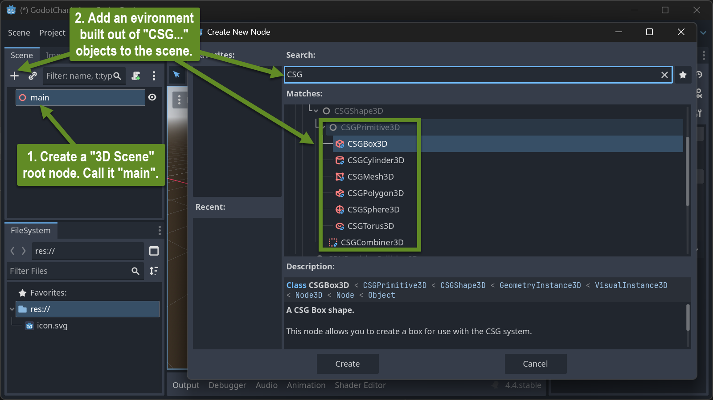
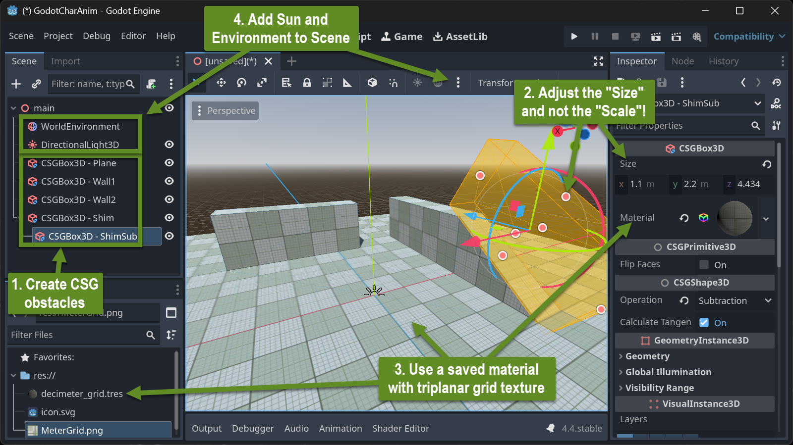
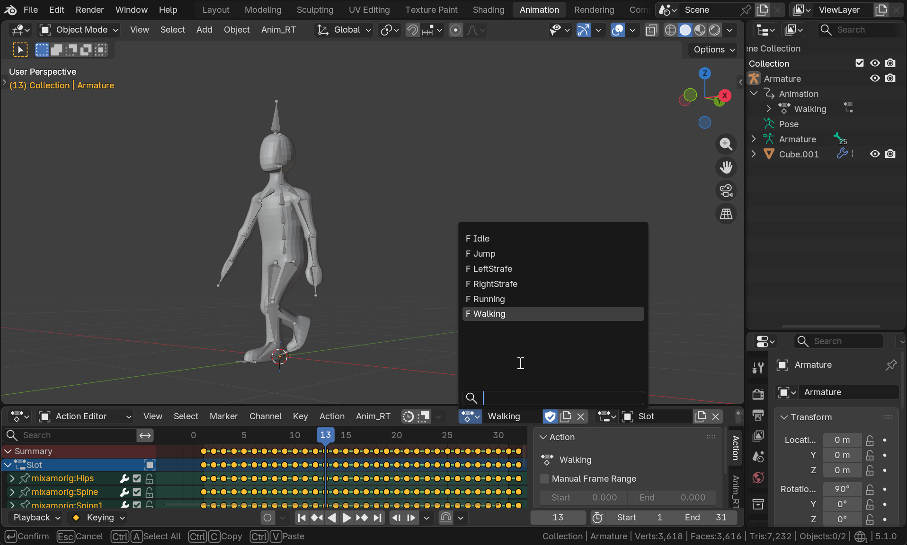
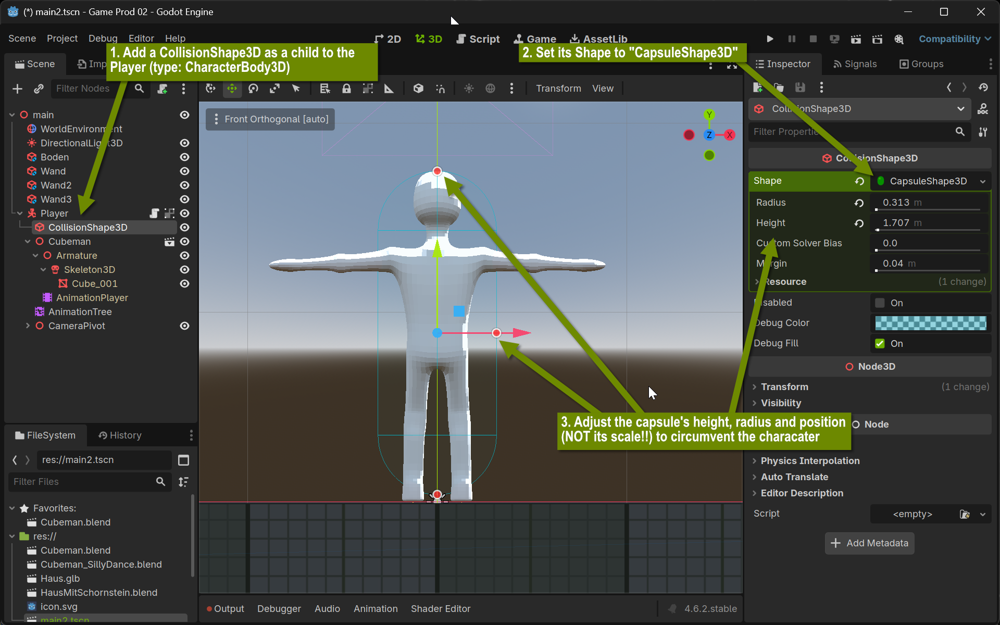
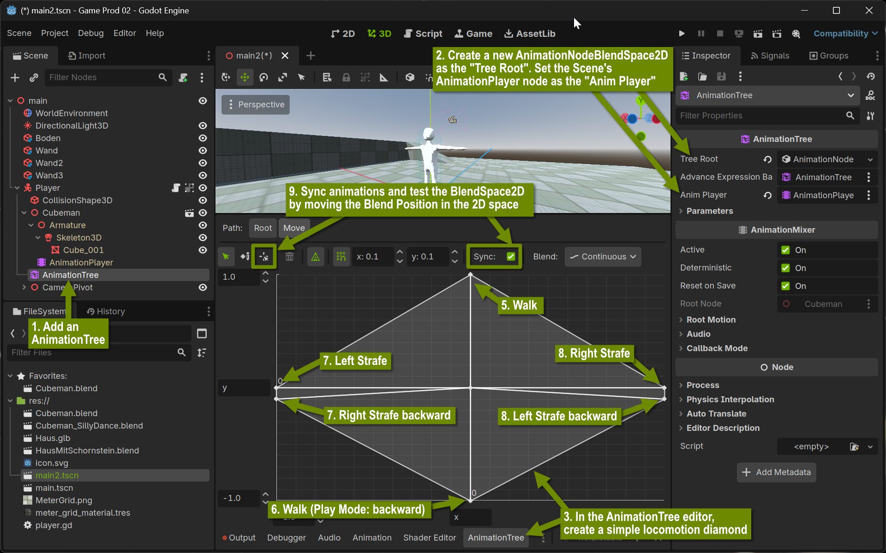
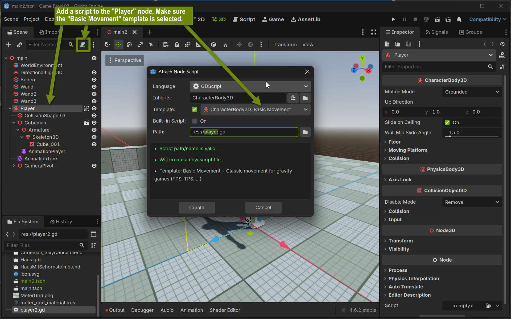
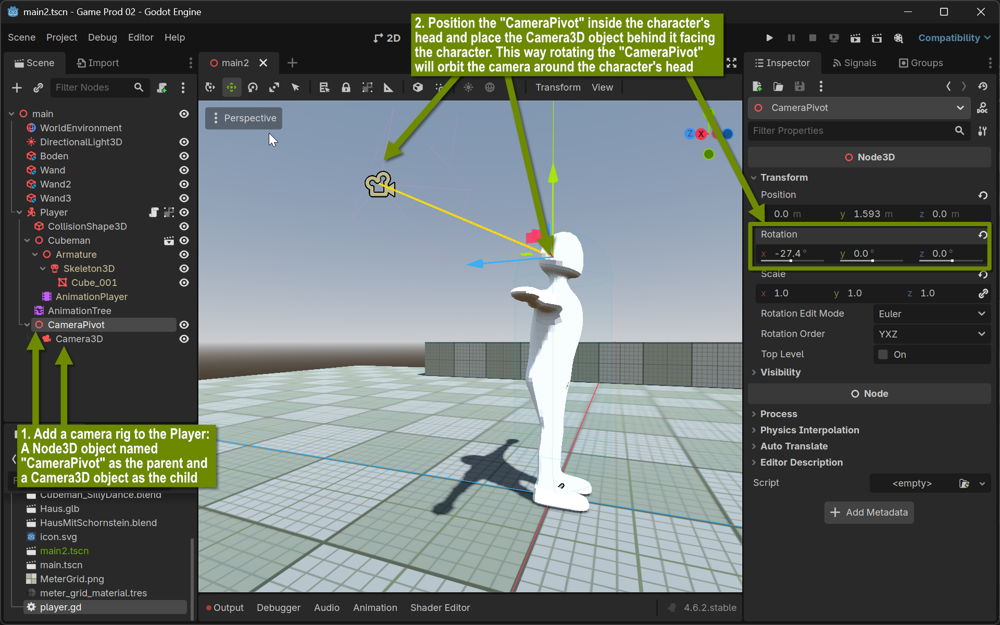

+++
title = 'Mixamo to Godot via Blender'
draft = false
weight = 20 
+++

## Contents

- Within this lesson you will learn 
  - how to apply ready-made body animations from Mixamo to a self-created character
  - how to assemble a set of Mixamo animations within Blender
  - how to export/import a character with a set of animation loops to Godot
  - how to set up a simple playground environment for your character in Godot
  - how to play back/blend the animation tracks depending on the user input to control the character


## Assemble a set of Mixamo animations within blender

- Export your single-object character as FBX (make sure no other objects such as camera, lights, etc. are exported) and upload it to Mixamo. Use Mixamo's auto-rigging feature to have it create a skeleton and bone weights for you

  Mixamo only supports FBX (various dialects) and Collada (DAE). Use FBX! Collada Export will look ugly in Blender - at least for the 3D Model (Skin).

  In Mixamo you can download various animations with the same 3D character - each as a single file. In Blender you want to have all animations either so called "Actions" or as individual NLA tracks on the same Character (Armature):

- Select various animations for your character. Download all FBX files with Skin, at 30FPS and without keyframe reduction. Choose animations for the following movements:
  - Idle
  - Walk/Run
  - Jump
  - Right Strafe
  - Left Strafe


### Combine Animations as Actions Tracks

- Import the first Mixamo file
- In the Dope Sheet Editor, select "Action Editor"
- Rename Action and Slot at the Action Editor's headline to meaningful names. Remember the Slot name
- For each remaining Mixamo file
  - Import the next Mixamo file - the same model is now twice in the scene. Each model with its own animation
  - Select the Armature that was just imported
  - Rename the just imported Animation clip (can be done in the Action Editor's headline or in the Outliner). If the animation should be looped (applies to all animations except for the Jump animation): postfix the Animation clip name with "-loop". Godot will recognize this on import and will automatically set the animation to be looped.
  - Rename the just imported Slot name to the exact Slot name given for the first imported Mixamo file
  - Select the Armature collecting all animations
  - In the Action Editor's headline, from the Clip Dropdown, select the to-be-imported clip that was just renamed
  - Delete the imported Armature and Character Geometry


## Setting Up a 3D-Test-Environment in Godot

### Build a Playground Made out of CSG Objects

#### Scene Setup



CSG stands for "Constructive Solid Geometry". These objects are meant for rapid prototyping a 3D scene environment only! Do not use them in production. They provide a fast way to build simple shapes using boolean operations. In addition, they are already static bodies for Godot's physics simulation.

#### A Simple Playground

Assemble a simple scene consisting of a CSG ground plane and some CSG obstacles to climb and to jump on.



- Use a meter scale for your future characters assuming that a typical biped is between 1m and 2m tall.
- Do not use the objects' "Node3D/Transform/Scale" property to adjust their size. Instead, use the "CSG*Box*3D/Size" property! Otherwise the physics engine will not work correctly.
- Assign your environment objects a material using the - ["Decimeter Grid"-Texture](img/MeterGrid.png) and have it generate triplanar UVs (under the material's UV1 setting). Make it "World Triplanar" and adjust the Scale to make the grid appear in meters.


### Import Animated Character

#### Preparation

- Assign all relevant animations on your single character Armature/Mesh as Actions in Blender as described in the previous topic. 
- Remove anything from the Blender file not part of the animated character (such as lights and the camera)
- Save the blender file containing your character with all animation tracks directly into your Godot project
- Make sure your Godot installation knows where your Blender is installed (Editor Menu -> Editor Settings -> File System -> Import -> Blender Path)




Activating the Godot Editor with the open project will make Godot import the .blend file. This will also extract all textures within the model as individual files within the project (sub-)directory.

### Build a character

#### Setup AnimationPlayer and AnimationTree

- Add a "CharacterBody3D" node to your playground scene. Rename the node to "Player"

- Drag the ".blend" file as a child into the CharacterBody3D named Player. The Character in its T-pose should appear

- Right-Click on the object representing the blend file in the scene tree and activate "Editable Children"

- Add a "CollisionShape3D" as a child to the "Player" node. Within the "CollisionShape3D"'s properties, add a capsule as its Collision shape. Adjust the capsule to roughly circumvent the character




- Add an "AnimationTree" node right under the "Player" node.
  - Wire its settings accordingly
  - Create a BlendSpace2D as the root
  - Set-up a simple locomotion diamond with idle forward, backwards and left and right sideways movement.



##### Create Locomotion Script and Wire to Animations

- Add a basic movement script to the root node



As a result, the code editor will open showing the following GDScript code

```python
extends CharacterBody3D

const SPEED = 5.0
const JUMP_VELOCITY = 4.5

func _physics_process(delta):
  # Add the gravity.
  if not is_on_floor():
    velocity += get_gravity() * delta

  # Handle jump.
  if Input.is_action_just_pressed("ui_accept") and is_on_floor():
    velocity.y = JUMP_VELOCITY

  # Get the input direction and handle the movement/deceleration.
  # As good practice, you should replace UI actions with custom gameplay actions.
  var input_dir = Input.get_vector("ui_left", "ui_right", "ui_up", "ui_down")
  var direction = (transform.basis * Vector3(input_dir.x, 0, input_dir.y)).normalized()
  if direction:
    velocity.x = direction.x * SPEED
    velocity.z = direction.z * SPEED
  else:
    velocity.x = move_toward(velocity.x, 0, SPEED)
    velocity.z = move_toward(velocity.z, 0, SPEED)

  move_and_slide()
```

Add a camera to the main scene, first at the root overlooking the playground, later 
as a child to the character mimicking a very simple 3rd person controller and try running the scene. Control the character with the arrow keys. Jump with the space bar.

Adjust the order of the input events (`"ui_left"`, ...) generating the `input_dir` vector to make the arrow keys move the character into expected directions.

**Try to understand the script**

Add four global variables before the `_physics process` method:

```python
var locomotion_blend_path : String = "parameters/blend_position"
@onready var animation_tree: AnimationTree = $AnimationTree
var input_cur : Vector2 = Vector2(0, 0)
var input_acc : float = 0.1
```

and add to lines of code right after the variable `input_dir` is declared and assigned:

```python
  input_cur += (input_dir - input_cur).clamp(Vector2(-input_acc, -input_acc), Vector2(input_acc, input_acc))
  animation_tree.set(locomotion_blend_path, input_cur)
```

The first line adds some delay on abrupt changes of the input_dir. `input_cur` follows `input_dir` with some easing.

The second line assigns this eased version of `input_dir` to the current position of the AnimationTree's 2D locomotion diamond blend space.

#### Add Rotation and Mouse Capture

Remove any camera from the main scene and build a camera rig within the characters scene.




Change the character controller script to the following (complete script):


```python
extends CharacterBody3D

const SPEED = 3.5
const JUMP_VELOCITY = 4.5
var camera_pan_speed : float = 0.003

var locomotion_blend_path : String = "parameters/blend_position"
@onready var animation_tree: AnimationTree = $AnimationTree
var input_cur : Vector2 = Vector2(0, 0)
var input_acc : float = 0.1

func _ready():
  Input.mouse_mode = Input.MOUSE_MODE_CAPTURED

func _physics_process(delta):
  # Add the gravity.
  if not is_on_floor():
    velocity += get_gravity() * delta

  # Handle jump.
  if Input.is_action_just_pressed("ui_accept") and is_on_floor():
    velocity.y = JUMP_VELOCITY

  # Get the input direction and handle the movement/deceleration.
  # As good practice, you should replace UI actions with custom gameplay actions.
  var input_dir = Input.get_vector("ui_right", "ui_left", "ui_down", "ui_up")
  input_cur += (input_dir - input_cur).clamp(Vector2(-input_acc, -input_acc), Vector2(input_acc, input_acc))
  animation_tree.set(locomotion_blend_path, input_cur)
  var direction = (transform.basis * Vector3(input_dir.x, 0, input_dir.y)).normalized()
  if direction:
    velocity.x = direction.x * SPEED
    velocity.z = direction.z * SPEED
  else:
    velocity.x = move_toward(velocity.x, 0, SPEED)
    velocity.z = move_toward(velocity.z, 0, SPEED)

  if Input.mouse_mode == Input.MOUSE_MODE_CAPTURED:
    # Handle Mouse speed to rotate player
    var mouse_vel = Input.get_last_mouse_velocity()
    var new_rot_y = rotation.y - mouse_vel.x * delta * camera_pan_speed
    var new_rot_x = clampf($CameraPivot.rotation.x + mouse_vel.y * delta * camera_pan_speed, -0.27 * PI/2, 0.8 * PI/2)
    rotation.y = new_rot_y
    $CameraPivot.rotation.x = new_rot_x
    
    if Input.is_action_just_pressed("ui_cancel"):
      Input.mouse_mode = Input.MOUSE_MODE_VISIBLE
  else:
    if Input.is_action_just_pressed("ui_cancel"):
      Input.mouse_mode = Input.MOUSE_MODE_CAPTURED

  move_and_slide()
```


## Assignment

- Prepare your character from Visual II or create a new one. Make sure it is a Biped in T-pose. Ideally made out of a single mesh using only standard materials (may include textures and normal maps)
  - If your existing Visual II char is not suited, create a simple "Cube Man" character using box modeling

- Upload your character to Mixamo, select and download the various movement animations (idle, walk, jump, left- and right-strafe)

- Generate a playground game scene in Godot using CSG objects. Use the [Meter Grid image](img/MeterGrid.png) with Triplanar UVs as a material

- Add the animated character and apply a simple 3rd person controller to it as described in detail above

- Practice keyframe animation in Blender: Create a simple animation using keyframes showing one of the 12 animation principles using a simple 3D model (cube, sphere)


