+++
title = 'Combining Blender-Rigify with Mixamo and Godot'
draft = false
weight = 20 
+++

## Contents

With Mixamo's pre-defined animations you can quickly setup an animated character using Blender, stack all the desired animations downloaded from Mixamo into Blender animation Actions and export the character with all animation tracks (or just use it) in Godot.

On the other hand you can use Blender's Rigify Add-On to create an decently detailed rig allowing you to comfortably hand-craft custom animations. Also these type of animations can be easily exported to Godot using Blender's glTF export setting "Armature / Export Deformation Bones Only" (or Godot's .blend-file import setting "Blender /Meshes / Export Bones Deforming Meshes Only" setting, when directly using .blend files as Godot assets).

A frequently asked question is how to combine these two worlds: 
 - Use Mixamo and Rigify animation Actions on the same character and export that to Godot, 
 
 or even more advanced:
 
 - Import Mixamo tracks into Blender and edit them using the versatile Rigify rig

This tutorial describes how to do that

## Rigify Model

### 00 Enable Add-Ons 

- Enable the Rigify Add-On 
  - Edit → Preferences → Add-Ons → Rigify: On
- Download and install the Retarget Extension from within Blender
  - Edit → Preferences → Extensions → Retarget

### 01 Open Character Model

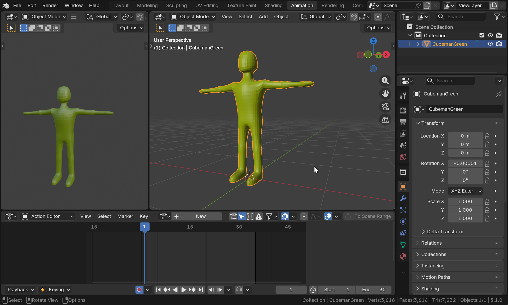

- Load the T-posed character model into Blender

### 02 Add Rifify Metarig

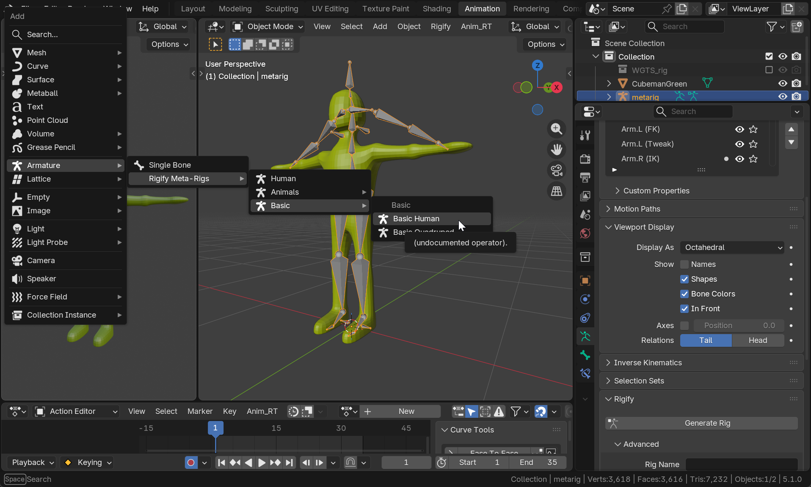

- In Object Mode, <kbd>Shift</kbd>+<kbd>A</kbd> → Armature → Rigify Meta-Rigs → Basic → Basic Human

- In the Properties Editor in the "metarig" Object's Data properties, enable Viewport Display → In Front to make the entire rig visible on top of the character model

### 04 Match metarig to Model

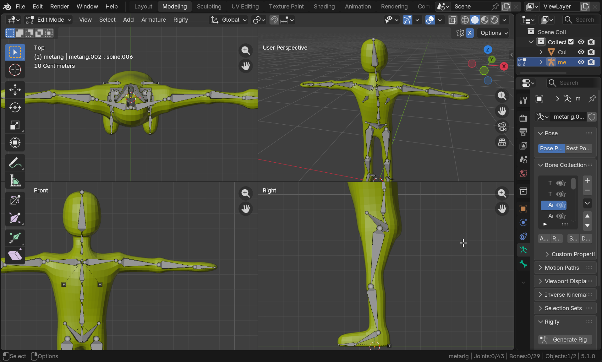

- Still in Edit mode, re-position the joints of the bones to make them match your character model
- Enable X-Symmetry
- Start with the feet and work all bones' joints up to the head
- Make sure to NOT disconnect Spine.003 and Spine.004 bones. If in the production rig creation step errors such as "bone position is disjoint" appear, [fix the bone connections](https://Blender.stackexchange.com/questions/169555/rigify-error-bone-cannot-connect-chain-bone).

## 05 Control the Upper Limbs Bone Generation

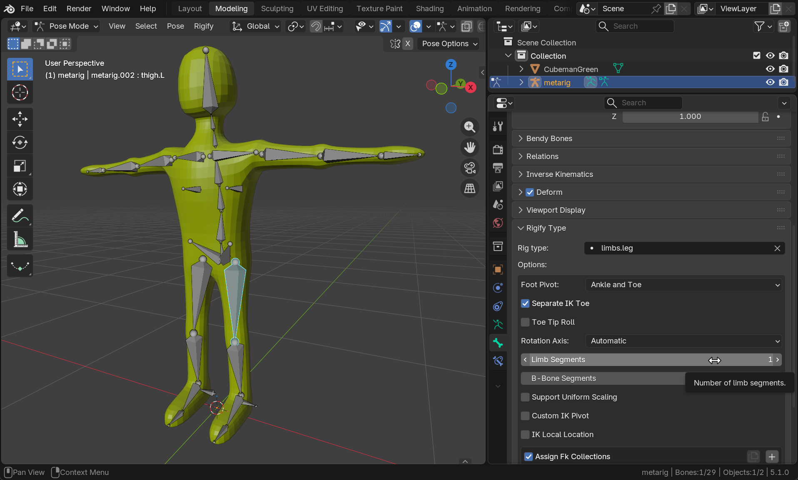

- Go into Pose Mode (with the metarig object selected)
- For each of the four upper limb bones
  - upper_arm.L
  - upper_arm.R
  - thigh.L
  - thigh.R...
- ...in the Properties Editor's Bone Tab's Rigify Type Settings adjust the number of Limb Segments to 1 (by default it's set to 2)

## 06 Generate the Rigify Production Rig

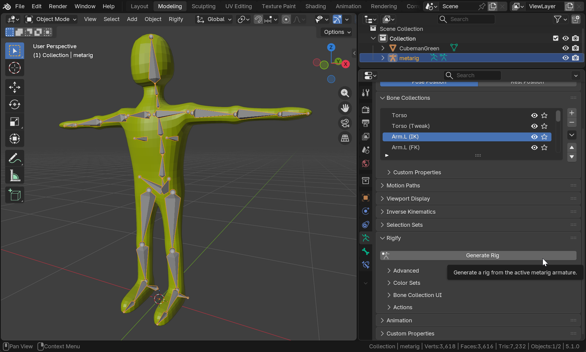

- In the metarig's Properties' Data panel, under the Rigify settings, hit the "Generate Rig" Button
- The production rig will appear with its visual IK/FK handle bones
- Switch the metarig invisible (in viewports as well as in render)

## 07 Bind the Model to the Production Rig

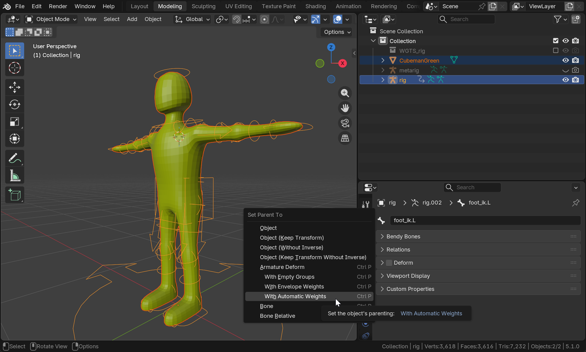

- In Object mode, in the 3D Editor, hold <kbd>Shift</kbd> and select in order
  1. the model (dark orange selection)
  2. the production rig (light orange selection)
- Hit <kbd>Ctrl</kbd>+<kbd>P</kbd> (Parent) and select Armature Deform With Automatic Weights
- Check that your character model moves well when the IK/FK handles are tranformed in Pose Mode

## 08 Make Deformation Bones Game Friendly

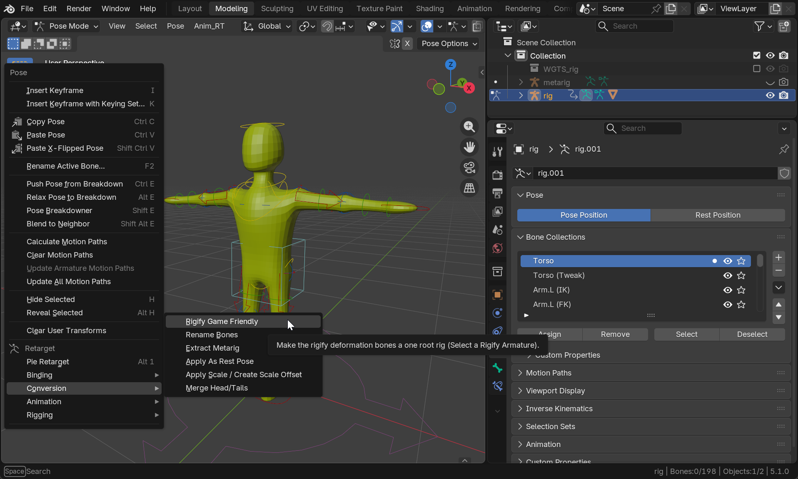

The bones in the production rig created by Rigify are organized in various categories: 
- The control bones (IK/FK handles)
- DEF (Deformation) bones directly deform the mesh and are used for skinning. 
- ORG (Original) bones are copied from the metarig and drive the system. 
- MCH (Mechanism) bones act as invisible helpers/drivers for complex motions, often connecting controls to deformation bones

The Deformation bones are controlled by applying the control bones' transforms, often by means of the mechanics bones. The Deformation bones are typically exported to game engines and here we'll want the DEF bones to receive the Mixamo animations.

Unfortunately, the DEF bones created by rigify are not well organized in a hierarchy as you'd expect (with chains from root over the spines to the head, hands and feet). Using the Retarget Add-On, this can be changed using a menu entry:

- In Pose Mode, right-click in the 3D Editor
- At the bottom of the context menu you will find the Retarget Add-On's menu entries
- Go to Conversion → Rigify Game Friendly

As a result, all the DEF-bones (the only ones that weights of the model are bound to) are well-organized in a biped-typical fashion.

## 09 Export to FBX

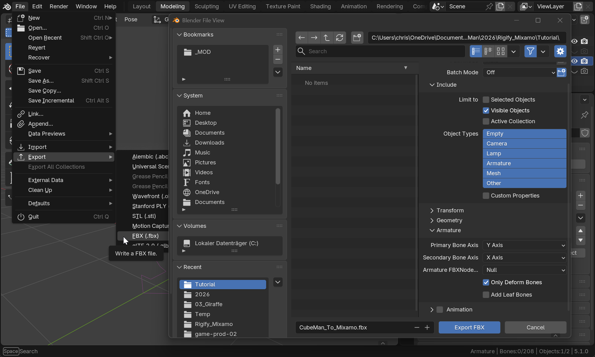

- Make sure the Rigify Armature with your character model as its child are the only visible objects in the scene. All other objects (including the initial metarig) should be set to invisible or deleted
- Go to File → Export → FBX
- In the File Export Dialog, on the right side panel
  - Check Include → Limit to → Visible Objects
  - Check Armature → Only Deform Bones
  - Uncheck Armature → Add Leaf Bones
  - Uncheck Animation
- Select a directory and file name of your choice and save the fbx file

## 10 Get Animation from Mixamo

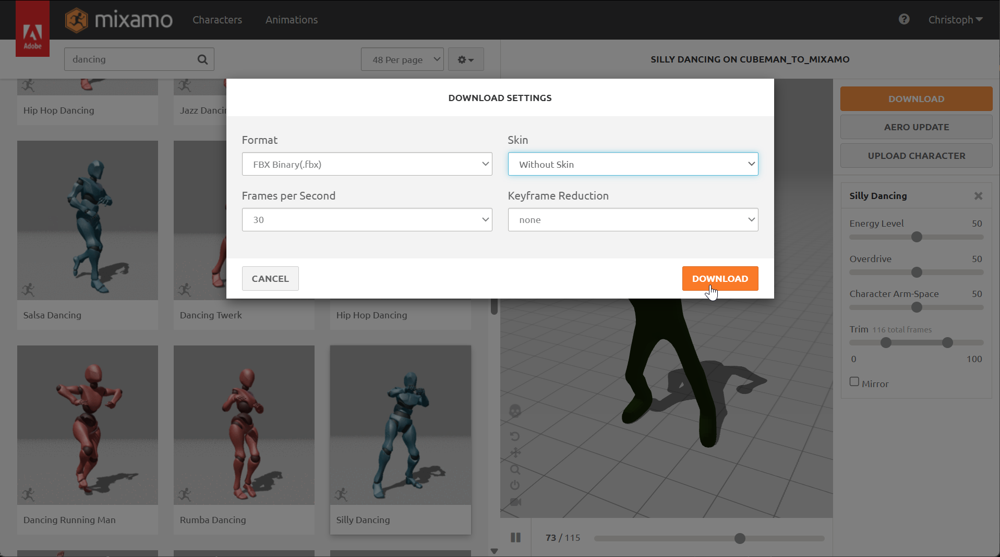

- Upload the just-created FBX to [Mixamo](https://mixamo.com)
  - You need an Adobe account to log in. Crate one for free
  - If uploading hangs, try again
  - Uploading should recognize the included deformation bones and the bone weights, so Mixamo should not perform any automatic rigging or ask you to identify landmarks (chin, wrists, ...) on your character
- Select you desired animation(s) and Download it (them)
- In the Download Settings, choose
  - FBX Binary (.fbx)
  - Without Skin
  - Your desired Frames per Second (30 FPS will do for games as keyframes are interpolated. If the Mixamo animation is very vivid and requires more temporal resolution, choose 60 FPS)
  - Keyframe Reduction: none

## 11 Import Mixamo FBX and Rename

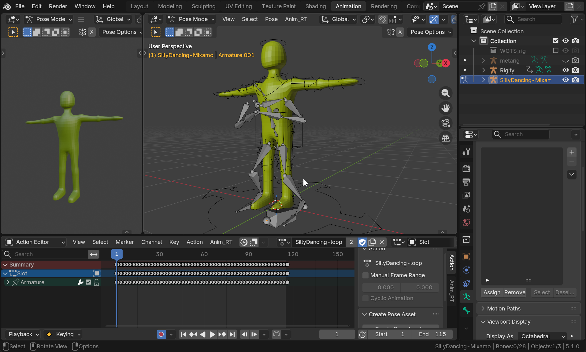

- Import the FBX downloaded by Mixamo (NOT the one you created for uploading) into Blender
  - You can simply drag the FBX file into blender
  - The standard import settings shoud do. Don't change them
- An animated rig (bone skeleton) performing the Mixamo animation should appear
- For clarity, 
  - Rename the Rigify armature containting your character model to somewhat with "Rigify"
  - Rename the armature imported from Mixamo (without any mesh model) to somewhat with "Mixamo"
  - In the Animation Workspace, in the Action Editor,
    - Rename the animation take to a meaningful name (e.g. the name of the animation sequence as it was called in Mixamo). Add the postfix "-loop" to it, if the animation should be played back looping later in the game engine. Godot will recognize this postfix and will automatically have the animation imported as looping
    - Rename the slot to something simple, e. g. "Slot".

## 12 Bind Rigify to Mixamo Armature

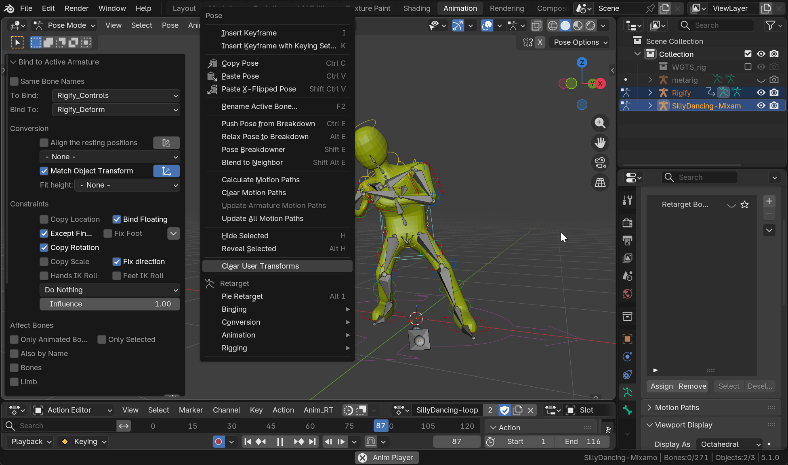

- In Object Mode, select the Rigify Armature first and then <kbd>Shift</kbd>-select the Mixamo Armature, resulting in the Rigify Armature selected in a dark orange and the Mixamo Armature selected in light orange
- Switch to Pose Mode
- Right-click into the 3D Editor. In the context menu, at the bottom, within the Retarget Add-On's settings click on Binding → Bind to Active Armature
- At the lower left of the 3D Editor, expand the "Bind to Active Armature" adjustment area
- The "To Bind:" setting describe the type of the armature that you want to use as the destination. This is the Rigify production rig, so enter "Rigify_Controls" here.
- The "Bind To:" setting describes the type of the armature that you want to use as the source. This is the animation rig you downloaded from mixamo and imported as FBX. Although you might feel tempted to choose one of the "Mixamo" settings, **the correct setting is "Rigify_Deform"**. This is, because the FBX you uploaded to Mixamo contained the Rigify Deform rig you created in Blender. Mixamo did not autorig your model but used the given rig to apply the animation to.

The animation should automatically play and you should see your model perform the same movements as the armature downloaded by Mixamo. This is currently accomplished by constraints that force the Rigify control rig to obey to the movements of the Mixamo rig.

In the next step the movements currently transferred by constraints are actually baked into keyframes on the Rigify control rig

## 13 Bake Constrained Actions

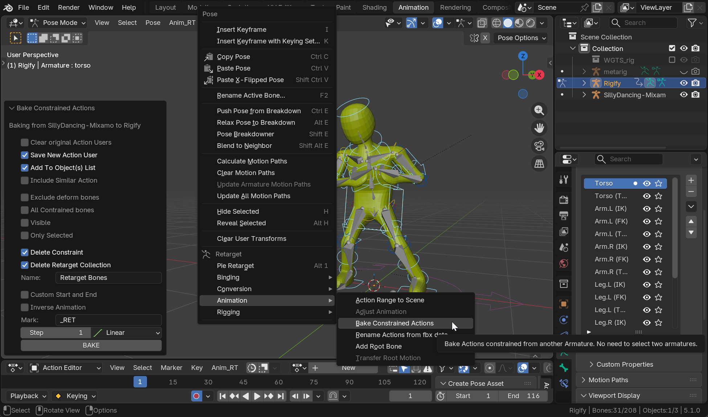

- Switch to Object Mode
- Select the Rigify armature, make sure the Mixamo armature is not selected any longer
- Switch to Pose Mode
- Right-click into the 3D Editor. In the context menu, at the bottom, within the Retarget Add-On's settings click on Animation → Bake Constrained Actions
- At the lower left of the 3D Editor, in the "Bake Constrained Actions" adjustment area, leave all settings at their defaults and click on the BAKE button

As a result, a new animation Action will be added to Rigify rig. Within that, for all control bones keyframes will be added containing the movement of the Action imported from Mixamo. You can edit and change the animations and keyframes, add other action etc.

## 14 Export to Godot

### Preparation

- The baked animation Action will probably have the armature's name as a prefix, separated by a vertical bar (`|`). This is to make it distinct from the original animation Action on the downloaded Mixamo armature. To rename it to its original name
  - Delete the imported mixamo armature
  - Delete the fake user from the original animation Action. Then finally delete this animation Action. Unfortunately this is a bit tricky:
    - Open the Outliner window (top right)
    - Change the display mode from "ViewLayer" to Blender File
    - Expand the Actions section
    - Right-click on the unused action and select Delete
    - Save and re-open your blend file
  - Rename the the baked Rigify animation Action to the desired name. Make sure to postfix the Action name with "-loop" if you want the animation take to be looped in Godot

### Use it in Godot

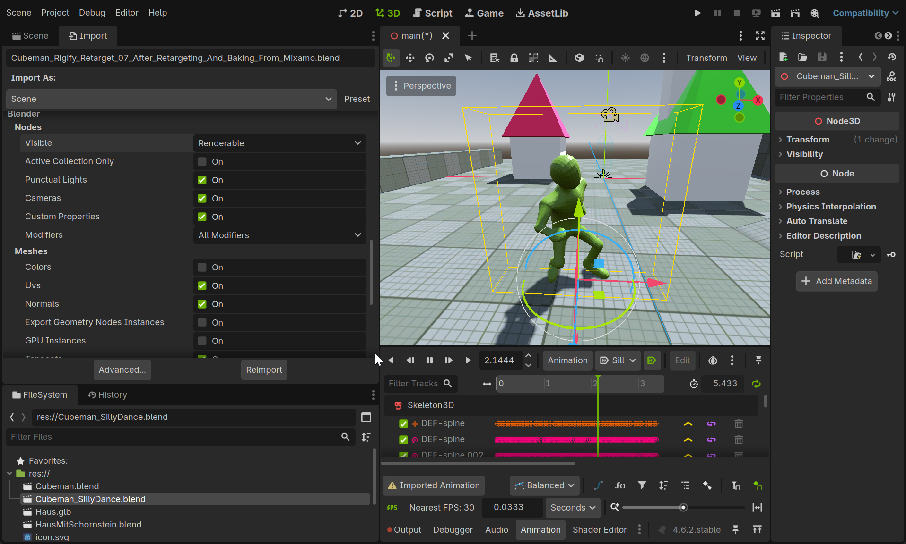

This describes how to directly use the .blend file within Godot. You could as well consider to export it (best as glTF) from Blender and then import the .glb within Godot.

- Make sure in Godot's Editor Settings the FileSystem → Import → Blender Path is set to the exact Blender version used for the steps above.
- Copy (or save) the Blender file directly within your Godot project's folder (or a subfolder)
- Within Godot, edit the .blend files Import settings (from the tab next to the Scene graph Tab on the top left part of the Godot editor's screen, NOT from the Advanced import settings window). Set the following
  - Animation → Import: On
  - Animation → Trimming: On - this will remove the last keyframe of loopable animations. Mixamo adds these keyframes as copys of the first keyframe of a loopable animation. If not set, Godot will display duplicate poses when repeating a loop showing notable animation hickups
  - Blender → Nodes → Visible: Renderable - this will enable you to control wether an object in the .blend file will be importet using its "Disable in Renders" flag (the small camera icon in the Blender Outliner). 
  - Blender → Meshes → Export Bones Deforming Mesh Only: On - This will only import the deformation (DEF) bones

## Assignment

- Create a movement cycle using your character of choice rigged with Rigify.
  - Make it a variation of a standard walk, e. g. hopping, asymetrical, sideways, ....
  - Either use the Rigify standard armature or try integrating your walk cycle into the Mixamo-animated character.

## How this Lesson Emerged

This lesson was initially inspired by [this tutorial video](https://www.youtube.com/watch?v=0wMONEpEXpQ). 

The video tutorial features the [Expy Kit Add-On](https://github.com/pKrime/Expy-Kit) and describes how to use it for the given task. Unfortunately the video does not go into deep detail about the various scenarios that can be dealt with the Expy Kit and how it works. In addition, trying to reproduce the contents with Blender 5.1 yields in bogus results, presumably due to bugs or incompatibilities between versions. 

The [Retarget Add-On](https://extensions.blender.org/add-ons/retarget/) forked Expy Kit, added bug-fixes, lifted it to Blender 5 and combined it with additional functionality from other Add-Ons. In addition, it is accessible via Blender's Extension web site - so you can download and install it directly from within Blender. Unfortunately there is no good documentation about the Add-On. There's no overview about the entire functionality, about the use cases covered by the Add-On, how to use it or how it internally works. There's an unorganized [list of videos](https://youtube.com/playlist?list=PLdUXkJ3Y-ZqGYr9qKwNFjUItzbfWL3Has&si=ax0hESIz-zkzEqMT) by the Add-On author with few explanation showing some use cases. Most of them are rather incomprehensive to unexperienced users. From that list, [this video](https://youtu.be/7CayV9BEQ14?si=3J_MrKvZaPO5EzWa) demonstrates a use case which is closest to our one described in this tutorial.

Nevertheless, trying to apply the steps from the initial video tutorial with the Retarget Add-On yielded success. So this is how it works :):

## Resources

- [Introduction to Rigify](https://www.youtube.com/watch?v=k3t_KjIuI7E) 10 min
- [Very detailed Rigify-Course](https://academy.cgdive.com/courses/rigify-basics), free but requires registration. Videos are also available on YouTube. Includes rigify-face-bone animation and rigging and animating a quadruped (dog). Several hours of video.

