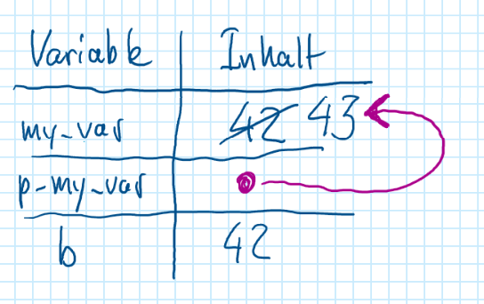
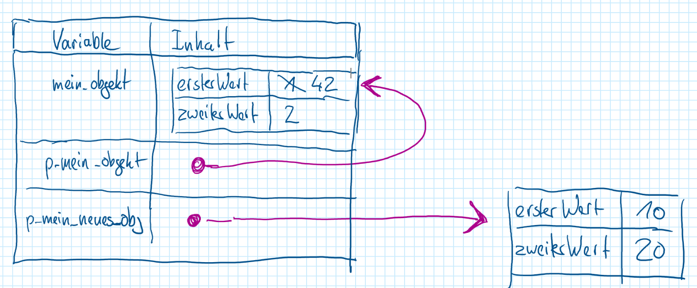
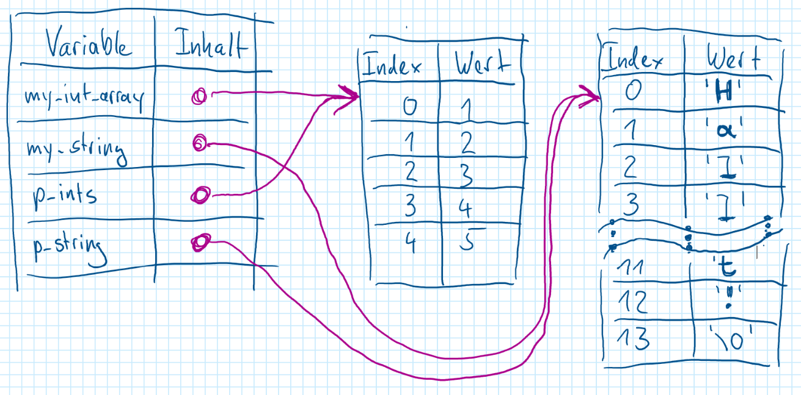

+++
title = 'C++ Eigenheiten'
draft = false
weight = 30 
+++

<!--
## Inhalte

- C++ basics
  - Eingebaute Datentypen
    - int
    - float/double
    - boolean
    - void
    - char
  - Struktur-Anweisungen
    - if/else
    - for/while
  - Deklarationen
    - Methoden/Funktions-Header
    - Klassen
- Die Speicher-"Verwaltung" in C++
  - managed vs. unmanaged
  - `new` und `delete`
- Reference vs. Value-Semantik
  - Pointer
  - Referenzen
- Arrays, Pointer und Strings
- Ein Notationssystem für Speicher-Inhalte
- Eigene Datentypen (Klassen und Strukturen)
  - Konstruktoren und Destruktoren
  - Header (.h) und Code-Dateien (.cpp)
-->

## Grundlagen C++

In dieser Lektion werden einige grundlegende Konzepte von C++ erklärt, darunter:
- Variablen und eingebaute Datentypen
- Zeiger (Pointer)
- Zeiger auf Objekte
- Arrays und Strings


### Variablen und eingebaute Datentypen

```cpp
int my_var = 42;
int other_var = my_var;
float my_float = 3.141592f;
double my_double = 3.141592;
bool my_bool = true;
my_bool = false;
char my_char = 'A';
```
Hier werden verschiedene Datentypen deklariert:
- **int**: Ganzzahlen
- **float**: Gleitkommazahl mit einfacher Genauigkeit
- **double**: Gleitkommazahl mit doppelter Genauigkeit
- **bool**: Wahrheitswerte (`true` oder `false`)
- **char**: Einzelnes Zeichen

#### Notationssystem

Für den aktuellen Kontext (hier: die Methode in der die Variablen deklariert wurden), wird eine Tabelle angelegt, in der links die Variablennamen und rechts deren Inhalte stehen. Die Variablennamen sind dabei untrennbar mit den Speicherinhalten verbunden.


### Zeiger (Pointer)
```cpp
int my_var = 42;
int* p_my_var = &my_var;
int b = *p_my_var;
*p_my_var = 43;
```
#### Erklärung
- `int* p_my_var = &my_var;` speichert die Speicheradresse von `my_var` in `p_my_var`.
- `int b = *p_my_var;` liest den Wert, auf den der Zeiger zeigt.
- `*p_my_var = 43;` ändert den Wert des Speichers, auf den `p_my_var` zeigt.

#### Fragen
- Was steht nach der Deklaration von `b` in der Variablen? → `42`
- Was steht in `my_var` nach Ausführung der letzten Zeile? → `43`

#### Notationssystem

Zeiger (die eigentlich Speicheradressen sind) werden durch einen Pfeil dargestellt. Der Pfeil beginnt in der Inhaltsspalte in der Zeile der Zeiger-Variablen und endet am Beginn des Speicherbereichs, der durch die Speicheradresse adressiert wird.




### Zeiger auf Objekte
```cpp
class MeineKlasse {
public:
    int ersterWert;
    int zweiterWert;
};
```
Die Klasse `MeineKlasse` hat zwei öffentliche Attribute: `ersterWert` und `zweiterWert`.

```cpp
MeineKlasse mein_objekt;
mein_objekt.ersterWert = 1;
mein_objekt.zweiterWert = 2;
```
Hier wird ein Objekt `mein_objekt` der Klasse `MeineKlasse` erstellt und dessen Werte gesetzt.


```cpp
MeineKlasse* p_mein_objekt = &mein_objekt;
p_mein_objekt->ersterWert = 42;
```
- `p_mein_objekt` ist ein Zeiger auf `mein_objekt`.
- `p_mein_objekt->ersterWert = 42;` ändert den Wert von `ersterWert` im Originalobjekt.

```cpp
MeineKlasse* p_mein_neues_obj = new MeineKlasse();
p_mein_neues_obj->ersterWert = 10;
p_mein_neues_obj->zweiterWert = 20;
```
Hier wird ein Objekt dynamisch auf dem Heap erstellt.

#### Frage
- Was steht in `mein_objekt.ersterWert`? → `42`

#### Notationssystem

Wie bei eingeauten Datentypen ist der Variablenname `mein_objekt` untrennbar mit dem Speicherinhalt verbunden. In der Speicher-Notation wird daher das Objekt direkt in die Tabelle eingetragen. 

Mit `new` erzeugte Objekte werden als neue Tabellen angelegt.



Mit `new` erzeugter Speicher ist nicht mit der Lebenszeit des Kontextes (z. B. der Methode, in der die Variable deklariert wird) verbunden. Mit `new` angelegter Speicher muss mit `delete` wieder gelöscht werden.


### Arrays und Strings
```cpp
int my_int_array[5] = {1, 2, 3, 4, 5};
char my_string[20] = "Hallo, Welt!";
```
- `my_int_array` ist ein Array mit fünf Ganzzahlen.
- `my_string` ist ein C-String, und damit ein Array von 'char'-Einträgen. Dieser Array enthält 13 Einträge:
  - Die ersten zwölf Einträge (an den Indizes 0..11) enthalten die Zeichen von `'H'`bis `'!'`
  - Der letzte Eintrag (am Index 12) enthält den Wert `0` (den char `'\0'`) als Markierung, dass der String dort endet.

#### Zeiger auf Arrays und Strings
```cpp
int *p_ints = my_int_array;
char *p_string = my_string;
```
Arrays und Strings sind intern Zeiger:
- `p_ints` zeigt auf das erste Element von `my_int_array`.
- `p_string` zeigt auf das erste Zeichen von `my_string`.

#### Notationssystem

Arrays sind eigene Tabellen, bei denen die Indizes in der ersten Spalte und die Array-Einträge in der zweiten Spalte stehen. 



Das oben stehendes Bild ist nicht ganz korrekt: Die `int`- und `string`-Arrays wurden nicht per `new` erzeugt sondern als Array- bzw. String-Konstanten. Daher werden diese im selben Kontext wie die lokalen Variablen erzeugt und müssten daher in der selben Tabelle stehen, wie die Array- und Pointer-Variablen (die dann auf die entsprechenden ersten Array-Einträge in der selben Tabelle zeigen). Aus Platzgründen wurden die Arrays in eigenen Tabellen gezeichnet.

## Ressourcen

- [C++ built-in types](https://learn.microsoft.com/en-us/cpp/cpp/fundamental-types-cpp?view=msvc-170)

- [VS Code für C++-Entwicklung in Windows konfigurieren](https://code.visualstudio.com/docs/cpp/config-msvc)
  - tasks.json verstehen und für die Verwendung mehrerer cpp-Files konfigurieren: 
    > You can modify your tasks.json to build multiple C++ files by using an argument like `${workspaceFolder}/*.cpp` instead of `${file}`. This will build all .cpp files in your current folder. You can also modify the output filename by replacing `${fileDirname}\\${fileBasenameNoExtension}.exe` with a hard-coded filename (for example `${workspaceFolder}\\myProgram.exe`).
    
  - launch.json verstehen und für das Debuggen einer aus mehreren cpp-Files bestehenden Applikation konfigurieren:
    > In the standard launch.json, `program` specifies the program you want to debug. Here it is set to the active file folder (`${fileDirname}`) and active filename with the `.exe` extension (`${fileBasenameNoExtension}.exe`), which if `helloworld.cpp` is the active file will be `helloworld.exe`. The args property is an array of arguments to pass to the program at runtime.

