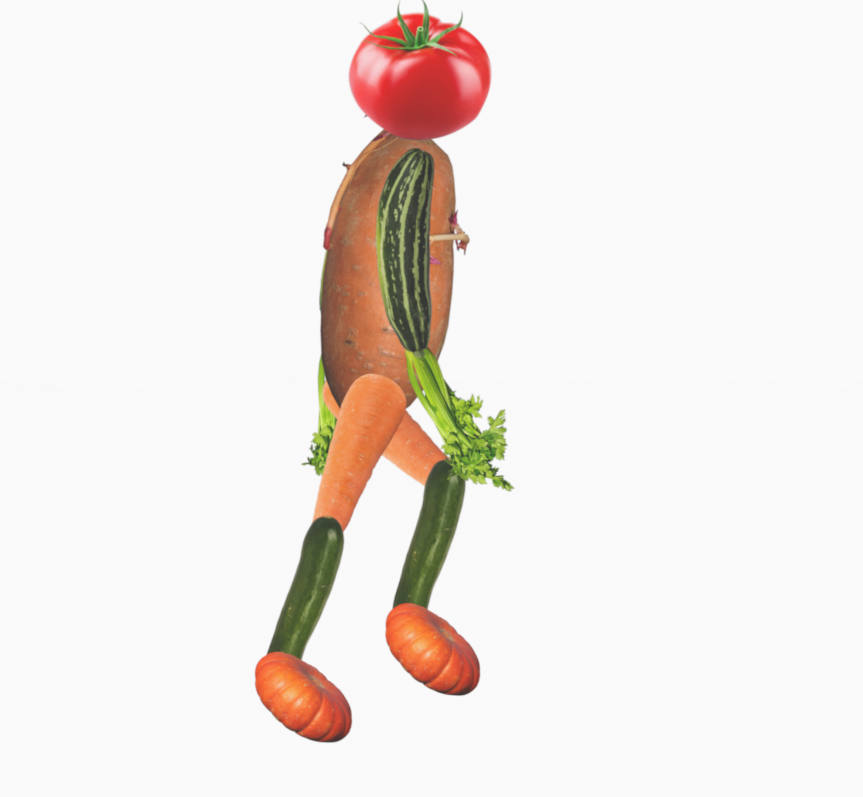

+++
title = 'Walk Cycle'
draft = false
weight = 30 
+++

## Walkcycle Breakdown

### 1. Contact Position

- The front foot contacts the ground with the heel.
- The opposite foot is about to leave the ground, toe pushing off.
- Arms are *almost* in their widest swing — opposite arm to the forward leg.
- This position starts and ends each step.

### 2. Down Position

- Weight shifts fully onto the front foot.
- The body's center of gravity lowers slightly.
- Front leg begins to absorb the impact.
- Arms continue to swing naturally past their midpoint.

### 3. Passing Position

- The rear foot lifts and passes by the planted foot.
- Legs are closest together, usually crossing at the knees.
- The torso is at its most centered and balanced.
- Arms are neutral, halfway through their swing.

### 4. Up Position

- The body lifts slightly as the rear leg pushes off.
- The front leg begins to stretch forward, preparing to contact.
- The heel of the rear foot is off the ground.
- Arms are nearing their peak in the forward/back swing.

## Assignment

- Take or collect photographs of every-day-life articles, such as vegetables from your kitchen, bathroom products, toys, etc.
  - Make sure there are rather round objects (similar width and height) and elongated objects (height significantly larger than width or vice versa).
  - Make sure the objects stand out from the background of the image.
- Cut out the objects from the image using an automated image-based selection tool (such as a a magic wand) from the image processing software of your choice.
    - Remove the background
    - Save the images as PNG files with a transparent background
- Start a new blender 2D animation file.
- Import the PNG images all at once using Add -> Image -> Mesh Plane
- Arrange the objects in a hierarchy resembling a biped character with a body, a head, arms and legs
- Animate a simple walk cycle. 
  - Aim at an animation loop of 24 frames 
  - Make the character move in position
  - Build a moving, conveyor-belt-like walking stage with visual cues to the movement. Can be setup easily with a couple of cubes
  - Start with the Contact position
  - Copy the initial contact position to frame 25 (one frame out of the animation loop)
  - Create a mirrored contact position at frame 13
  - Create the Passing position at frame 7 (mirrored at 19)
  - Create the Down position at frame 4 (mirrored at 16)
  - Create the Up position at frame 10 (mirrored at 22)

## Questions

- Which of the animation principles did you - deliberately or not - get in touch with while creating your walk cycle?