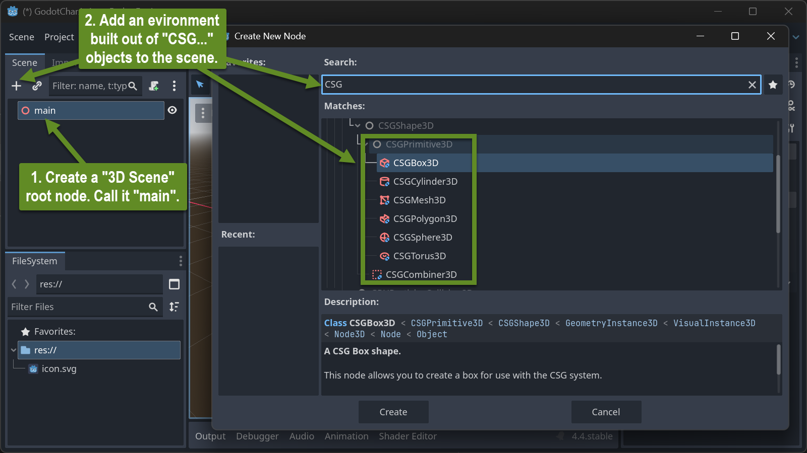
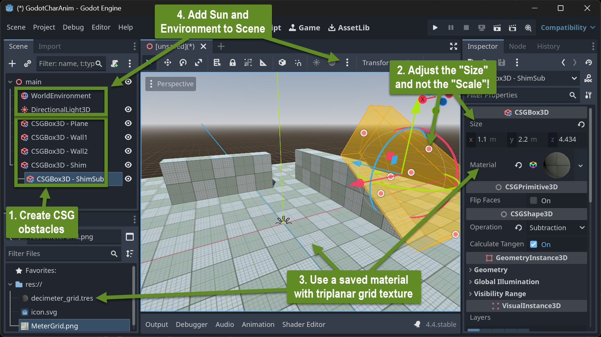
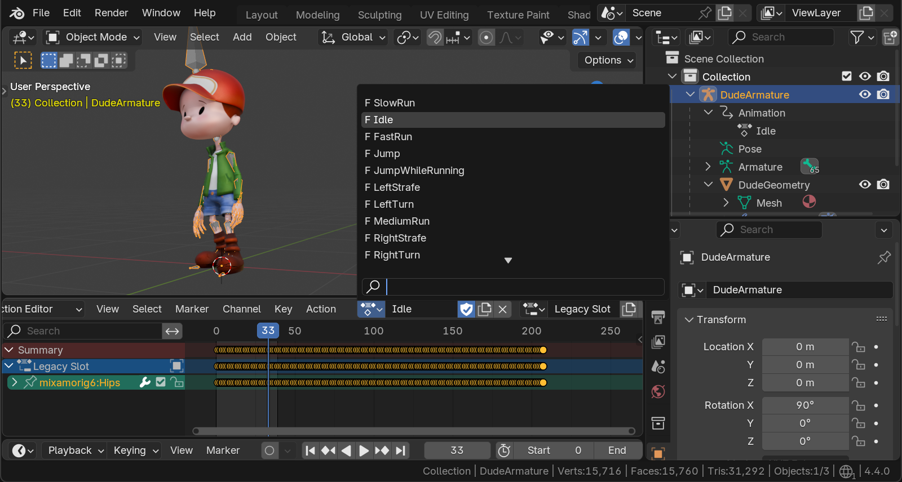
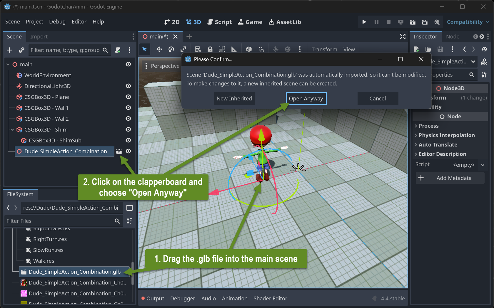
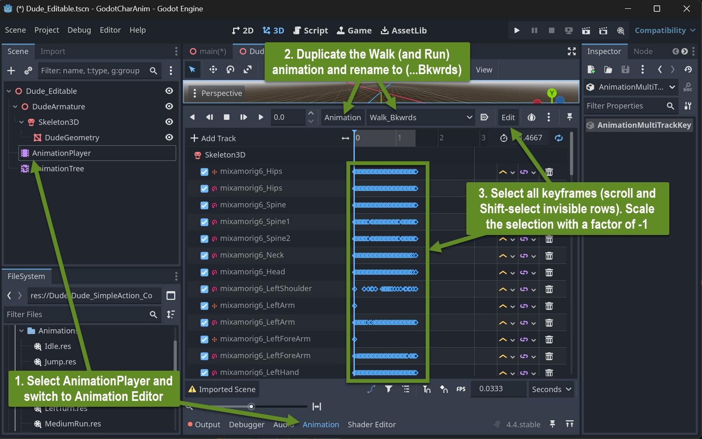
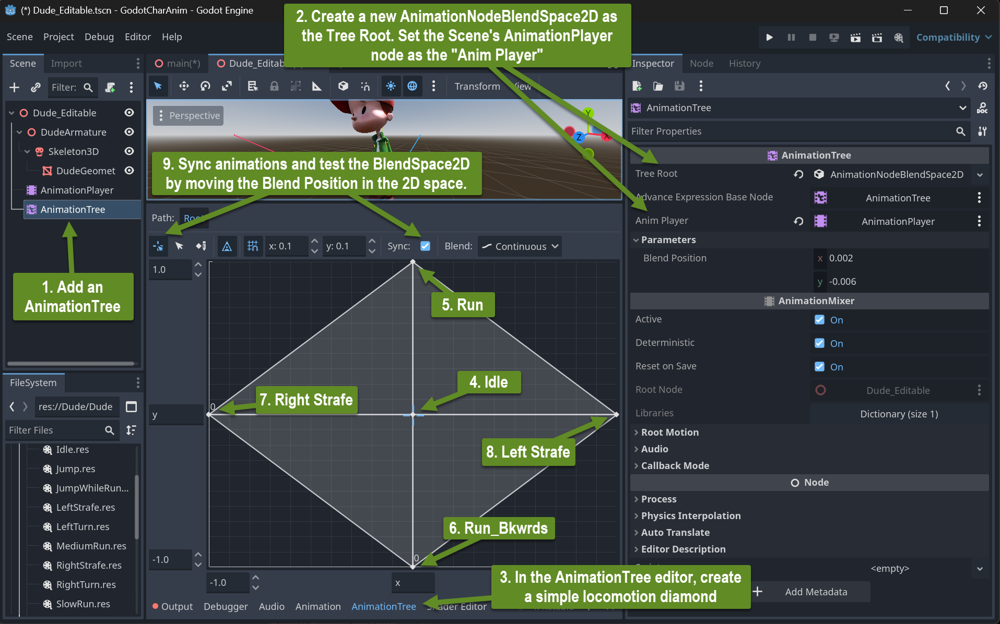
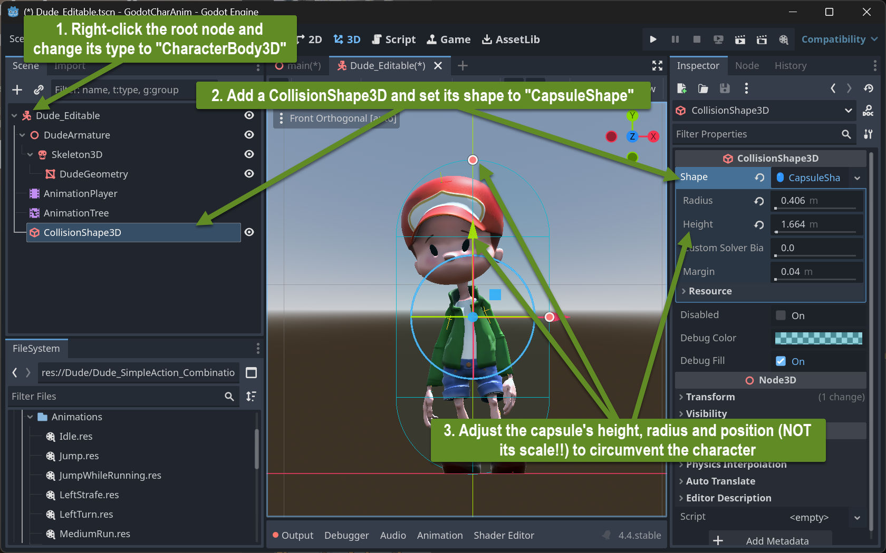
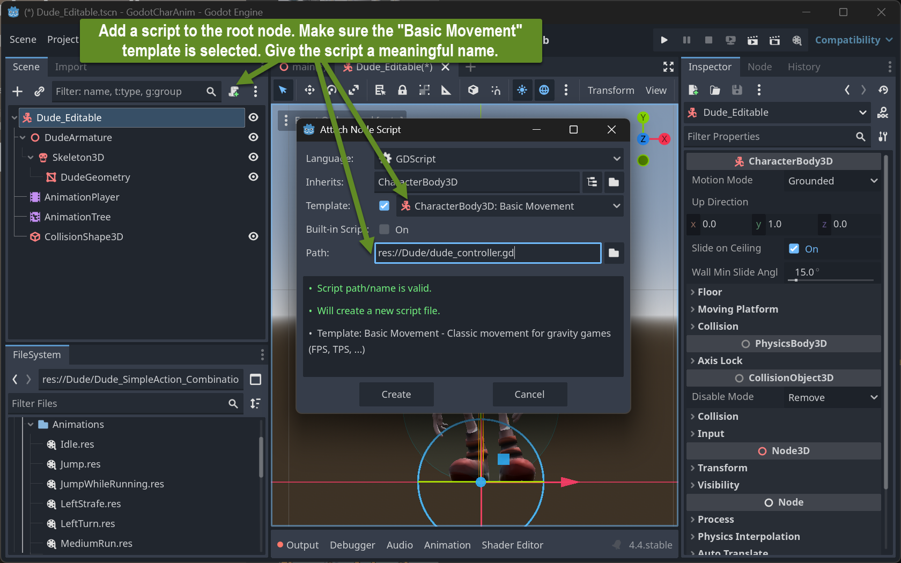
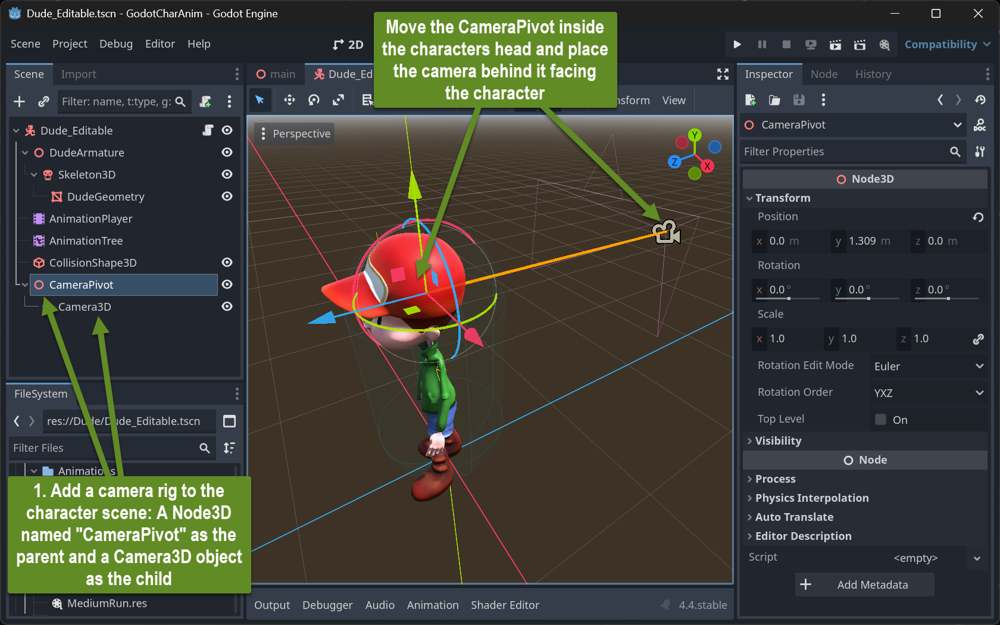

+++
title = 'Game Engine Char Animation'
draft = false
weight = 50 
+++

## Contents

- Setting up a 3D-Test-Environment (Player-Playground) in Godot
- Adding a Char with Mixamo Animations
- Setting up a Char Controller 


## Setting Up a 3D-Test-Environment in Godot

### Build a Playground Made out of CSG Objects

#### Scene Setup



CSG stands for "Constructive Solid Geometry". These objects are meant for rapid prototyping a 3D scene environment only! Do not use them in production. They provide a fast way to build simple shapes using boolean operations. In addition, they are already static bodies for Godot's physics simulation.

#### A Simple Playground

Assemble a simple scene consisting of a CSG ground plane and some CSG obstacles to climb and to jump on.



- Use a meter scale for your future characters assuming that a typical biped is between 1m and 2m tall.
- Do not use the objects' "Node3D/Transform/Scale" property to adjust their size. Instead, use the "CSG*Box*3D/Size" property! Otherwise the physics engine will not work correctly.
- Assign your environment objects a material using the - ["Decimeter Grid"-Texture](img/MeterGrid.png) and have it generate triplanar UVs (under the material's UV1 setting). Make it "World Triplanar" and adjust the Scale to make the grid appear in meters.


### Import Animated Character

#### Preparation

- Assign all relevant animations on your single character Armature/Mesh as Actions in Blender as described in the previous topic. 
- Remove anything from the Blender file not part of the animated character (such as lights and the camera)
- Export the Armature and the contained/controlled mesh including animations to the glTF format in binary form, creating a ".glb" file. Make sure the file is self-contained with all textures used on the character model.
- Move the glb file into the Godot project folder (or a one of its sub-folders). 



Activating the Godot Editor with the open project will make Godot import the glb file. This will also extract all textures within the model as individual files within the project (sub-)directory.

- Adjust the import settings: Open the Advanced Import Settings and make Godot save all animation clips to individual ".res" files:


### Build a character

#### Setup AnimationPlayer and AnimationTree

Drag the ".glb" file into your main 3D Scene. The Character in its T-Pose should appear. To make certain aspects of the model editable, we will create a new scene for it: Click on the clapperboard icon next to the character's node in the main scene. A confirmation dialog will appear. Choose the "Open Anyway" option.



Save (using "Save Scene As...") the newly created scene with a meaningful name, e.g postfixed by "editable.tscn".

In the main scene, remove the just-added glb-character node and add the "...editable" tscn-scene instead.

In the editable scene's AnimationPlayer create backwards movements for all used forward movements, such as Walk and Run.



Add an "AnimationTree" node right under the existing AnimationPlayer node.
- Wire its settings accordingly
- Create a BlendSpace2D as the root
- Set-up a simple locomotion diamond with idle forward, backwards and left and right sideways movement.



##### Create Locomotion Script and Wire to Animations

- Change the type of the character scene's root node to "CharacterBody3D"
- Add a CollisionShape3D capsule



- Add a basic movement script to the root node



As a result, the code editor will open showing the following GDScript code

```python
extends CharacterBody3D

const SPEED = 5.0
const JUMP_VELOCITY = 4.5

func _physics_process(delta):
	# Add the gravity.
	if not is_on_floor():
		velocity += get_gravity() * delta

	# Handle jump.
	if Input.is_action_just_pressed("ui_accept") and is_on_floor():
		velocity.y = JUMP_VELOCITY

	# Get the input direction and handle the movement/deceleration.
	# As good practice, you should replace UI actions with custom gameplay actions.
	var input_dir = Input.get_vector("ui_left", "ui_right", "ui_up", "ui_down")
	var direction = (transform.basis * Vector3(input_dir.x, 0, input_dir.y)).normalized()
	if direction:
		velocity.x = direction.x * SPEED
		velocity.z = direction.z * SPEED
	else:
		velocity.x = move_toward(velocity.x, 0, SPEED)
		velocity.z = move_toward(velocity.z, 0, SPEED)

	move_and_slide()
```

Add a camera to the main scene, first at the root overlooking the playground, later 
as a child to the character mimicking a very simple 3rd person controller and try running the scene. Control the character with the arrow keys. Jump with the space bar.

Adjust the order of the input events (`"ui_left"`, ...) generating the `input_dir` vector to make the arrow keys move the character into expected directions.

**Try to understand the script**

Add four global variables before the `_physics process` method:

```python
var locomotion_blend_path : String = "parameters/blend_position"
@onready var animation_tree: AnimationTree = $AnimationTree
var input_cur : Vector2 = Vector2(0, 0)
var input_acc : float = 0.1
```

and add to lines of code right after the variable `input_dir` is declared and assigned:

```python
  input_cur += (input_dir - input_cur).clamp(Vector2(-input_acc, -input_acc), Vector2(input_acc, input_acc))
  animation_tree.set(locomotion_blend_path, input_cur)
```

The first line adds some delay on abrupt changes of the input_dir. `input_cur` follows `input_dir` with some easing.

The second line assigns this eased version of `input_dir` to the current position of the AnimationTree's 2D locomotion diamond blend space.

#### Add Rotation and Mouse Capture

Remove any camera from the main scene and build a camera rig within the characters scene.




Change the character controller script to the following (complete script):


```python
extends CharacterBody3D

const SPEED = 3.5
const JUMP_VELOCITY = 4.5
var camera_pan_speed : float = 0.003

var locomotion_blend_path : String = "parameters/blend_position"
@onready var animation_tree: AnimationTree = $AnimationTree
var input_cur : Vector2 = Vector2(0, 0)
var input_acc : float = 0.1

func _ready():
	Input.mouse_mode = Input.MOUSE_MODE_CAPTURED

func _physics_process(delta):
	# Add the gravity.
	if not is_on_floor():
		velocity += get_gravity() * delta

	# Handle jump.
	if Input.is_action_just_pressed("ui_accept") and is_on_floor():
		velocity.y = JUMP_VELOCITY

	# Get the input direction and handle the movement/deceleration.
	# As good practice, you should replace UI actions with custom gameplay actions.
	var input_dir = Input.get_vector("ui_right", "ui_left", "ui_down", "ui_up")
	input_cur += (input_dir - input_cur).clamp(Vector2(-input_acc, -input_acc), Vector2(input_acc, input_acc))
	animation_tree.set(locomotion_blend_path, input_cur)
	var direction = (transform.basis * Vector3(input_dir.x, 0, input_dir.y)).normalized()
	if direction:
		velocity.x = direction.x * SPEED
		velocity.z = direction.z * SPEED
	else:
		velocity.x = move_toward(velocity.x, 0, SPEED)
		velocity.z = move_toward(velocity.z, 0, SPEED)

	if Input.mouse_mode == Input.MOUSE_MODE_CAPTURED:
		# Handle Mouse speed to rotate player
		var mouse_vel = Input.get_last_mouse_velocity()
		var new_rot_y = rotation.y - mouse_vel.x * delta * camera_pan_speed
		var new_rot_x = clampf($CameraPivot.rotation.x + mouse_vel.y * delta * camera_pan_speed, -0.27 * PI/2, 0.8 * PI/2)
		rotation.y = new_rot_y
		$CameraPivot.rotation.x = new_rot_x
		
		if Input.is_action_just_pressed("ui_cancel"):
			Input.mouse_mode = Input.MOUSE_MODE_VISIBLE
	else:
		if Input.is_action_just_pressed("ui_cancel"):
			Input.mouse_mode = Input.MOUSE_MODE_CAPTURED

	move_and_slide()
```

## Assignment

- Build a character controller around your own "simple" character and put it into a decimeter-grid playground world.
- Adjust animation speeds to make the walk/run/strafe animations appear to be the source of the locomotion.

## Resources

### Godot Basics

- [Godot Engine](https://godotengine.org/)
- [Introduction Tutorial 3+ hours](https://www.youtube.com/watch?v=A3R6T1h0ln8)
- [Godot Physics](https://docs.godotengine.org/en/stable/tutorials/physics/physics_introduction.html)
- [GD-Script Reference](https://docs.godotengine.org/en/stable/tutorials/scripting/gdscript/gdscript_basics.html)
- ["Decimeter Grid" Texture](images/MeterGrid.png)
- Optional:
  - [Godot Tools Extension for VS Code](https://marketplace.visualstudio.com/items?itemName=geequlim.godot-tools)
  - [Configuration of Godot Tools](https://www.reddit.com/r/godot/comments/16ve6y3/how_to_get_vscode_working_nicely_with_godot_and/)


### Animation Controllor Setup

- [Bonkahe Character Animation Tutorial Play List](https://www.youtube.com/playlist?list=PLV5T4EgpiiGPdtBDJO_K4bhab3_xKnNJ5)
  - [Blender Exporting and Godot Importing](https://www.youtube.com/watch?v=j4zL3u0BSBY&list=PLV5T4EgpiiGPdtBDJO_K4bhab3_xKnNJ5&index=2&pp=iAQB). Prepare hand-made animations in Blender.
  - [Importing and Authoring Animations](https://www.youtube.com/watch?v=sij-VgRbq3g&list=PLV5T4EgpiiGPdtBDJO_K4bhab3_xKnNJ5&index=3&pp=iAQB). Rather the Godot Combination Process from the last lesson.
  - [Animation Tree Part 1](https://www.youtube.com/watch?v=n872lbC-_BU&list=PLV5T4EgpiiGPdtBDJO_K4bhab3_xKnNJ5&index=4&pp=iAQB). Overview over the various nodes making up an AnimationTree.
  - [Basic Character Controller](https://www.youtube.com/watch?v=l4uWdObc4do&list=PLV5T4EgpiiGPdtBDJO_K4bhab3_xKnNJ5&index=5&pp=iAQB). Building up an AnimationTree made of a BlendSpace2D locomotion combined in a state machine with a jump and a fall animation.
  - [State Transitions and Calling Methods](https://www.youtube.com/watch?v=fBcKIxgJv-c&list=PLV5T4EgpiiGPdtBDJO_K4bhab3_xKnNJ5&index=6&pp=iAQB0gcJCYQJAYcqIYzv). Connect code events and states to trigger and control the AnimationTree contents (locomotion BlendSpace2D and state machine).


