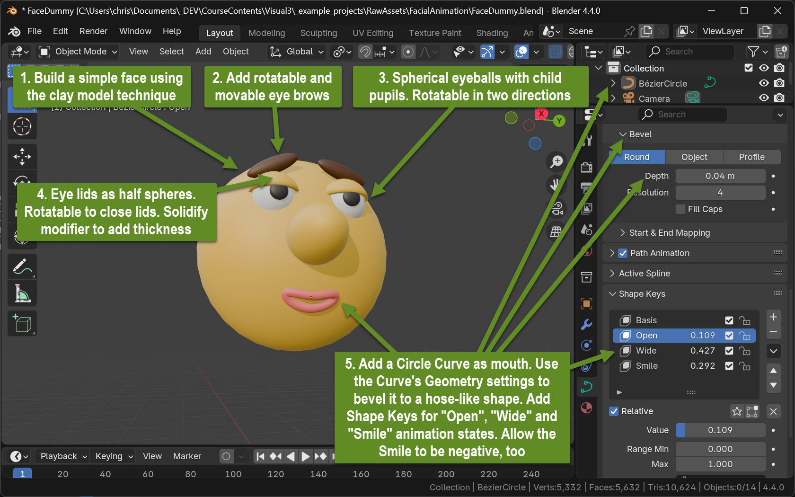
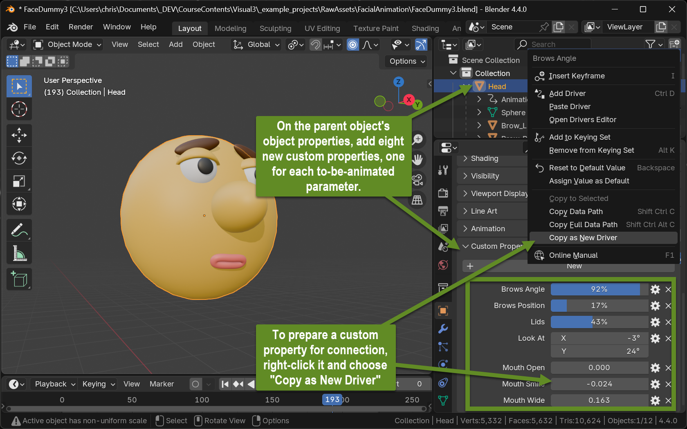
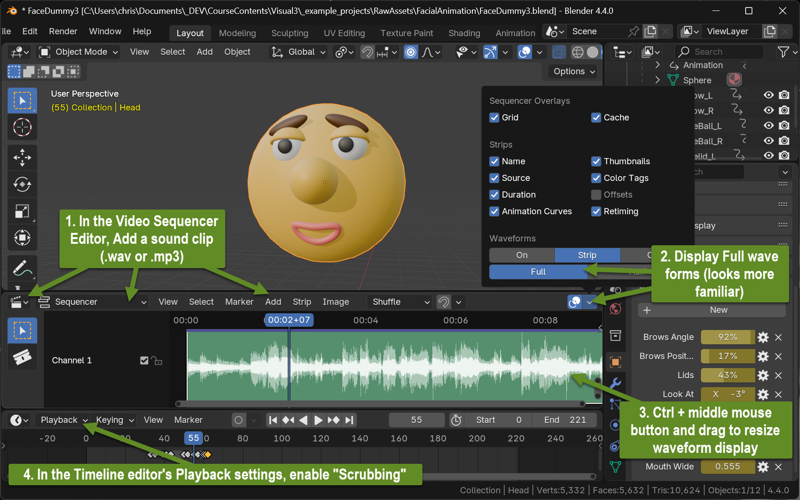

+++
title = 'Facial Animation'
draft = false
weight = 70 
+++

## Contents

- Set up a simple face model with only a few animatable features
- Basic principles of facial animation
- Lip-Synching

## Set Up a Simple Face Model

### Create geometry

Use the clay-modeling approach from Visual II to build a simple face made out of individual objects

- Add eye brows that can be moved and rotated
- Add spherical eye balls with pupils attached as children
- Add semi-spheres as eye brows
  - Add a full sphere and cut half of it away
  - Make sure they can close the eye by rotating around a principle axis
  - Give them a certain thickness by adding a "Solidify" modifier
- Add an animatable mouth using a bézier curve.
  - Add -> Curve -> Circle
  - In the curve's object settings, adjust the Geometry -> Bevel -> Depth setting to draw a hose-mesh around the curve
  - In edit mode, adjust the circle's four bézier points (and their control points) to give the mouth a closed, narrow and neutral (no smile) expression
  - In the curve's object settings, under Shape Keys, add this as the base expression.
  - Add three more expressions and shape the mouth accordingly:
    1. "Open" - open the mouth to its widest extent
    2. "Wide" - widen the mouth to its widest extent (move the left and right bézier points horizontally far away from each other)
    3. "Smile" - draw move the left and right bézier points upwards and the middle points slightly downwards. Extend this keys Range Min to -100

### Build a Dash Board

Group all objects into the main head model and add a custom property for each of the eight degrees of freedom

1. Brow movement
2. Brow "squeeze" (angle)
3. Lid movement (open and close the eye)
4. Pupil movement: look up/down 
5. Pupil movement: look left/right
6. Mouth: Open
6. Mouth: Smile
6. Mouth: Wide

### Connect Driven Properties

With each custom property: Right-click the property and choose "Copy as New Driver". Then attach the driver to the respective property to be controlled:

### Prepare for animation

For all eight custom properties: Right-click the property and choose "Add to Keying Set". This will generate a keyframe for each of the eight parameters if `I` is hit during animation.

## Basic Face Animation Principles

- Keep movements short. Facial features don't have significant masses, thus almost no easing occurs. Movement only takes a few frames. Static poses last longer until the next movement is performed
- Brows
  - Up and down show the alertness: Up: char is alert. Down: char is less alert. Down in combination with squeeze can underline bad emotions
  - Rotation in facial plane: 
    - "Squeeze": inner brow tips are down, outer brow tips are up: Character is serious, upset or mean
    - Opposite Squeeze: Character is happy, friendly or light-minded
- Lids
  - Open and close lids from time to time for blinking.
    - Usually blinks are extremely short (1-2 frames per lid up- and down movement). Slower blinks might signal fatigue or sickness.
    - Blinking frequency might tell viewers about the character's state (few blinks: staring, many blinks: nervous)
    - Humans frequently blink when changing the viewing direction 
  - Use the distance between lower lid border and upper pupil border to express the character's alertness
    - Lower lid border touches upper pupil border: no (neutral) alertness
    - The white of the eyeball is visible between lid and pupil: Character is alert (surprised, anxious...)
    - Lid partly covers pupil: Character is tired, sleepy, sick, or bored
- Pupils
  - The main purpose of the pupils is obviously to express the characters viewing direction
  - The viewing direction can also express emotions
    - Looking down: Character is sad, disappointed
    - Looking up: Character seeks help (from above)
    - Looking up and left/right: Character lies, is dreaming
    - viewing direction can also vary over time: "Rolling his eyes"
  - As described under lids: Use the distance between pupil and lid to vary expressions. Keep a constant distance while moving the pupils to change the viewing direction without changing the expression

## Import Audio and Prepare for Lip Synching

## Assignment

- Choose a short take (10-20 seconds) of spoken or sung language
- Create an animation of your face character using the eight properties with lip-synched mouth movement and showing additional facial expressions/emotions, if possible, matching the audible lines.

